# 3D Motion Planning for Generalized Dubins Vehicle considering Pitch and Yaw Rate Constraints

The repository contains the code for generating feasible solutions for the 3D Dubins problem using spheres, cylinders, and planes to connect an initial configuration to a final configuration.

# Animations

## Motivation: The Role of Roll Angle

A key motivation for this work is that a straight-line segment connecting two configurations is not always feasible — the roll angle of the vehicle at the endpoints must also be accounted for. The two animations below show the same heading and pitch but differ in roll angle, illustrating why roll must be treated as part of the configuration.

| Roll = 0° | Roll = 45° |
|:---------:|:----------:|
| 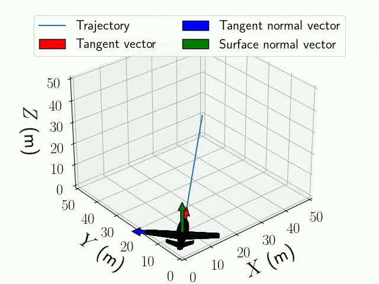 | 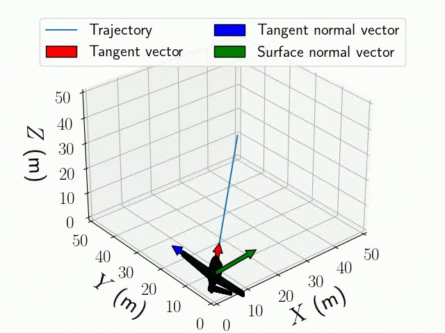 |

## Bounded Pitch and Yaw Rate Constraints

We consider two essential constraints: a bounded pitch rate and a bounded yaw rate. Geometrically, these constraints manifest as four spheres surrounding each configuration — two for yaw (left turn, right turn) and two for pitch (pitch up on the inner sphere, pitch down on the outer sphere). The animations below show each of these four fundamental maneuvers.

| Left Turn (yaw) | Right Turn (yaw) |
|:---------------:|:----------------:|
| 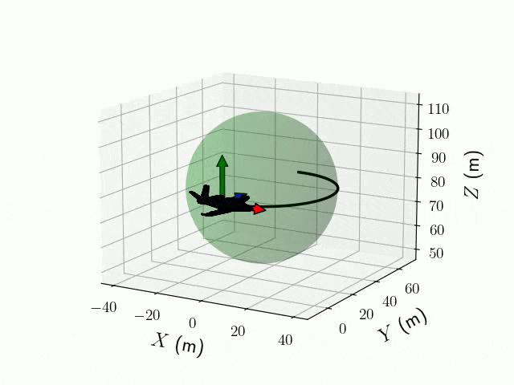 | 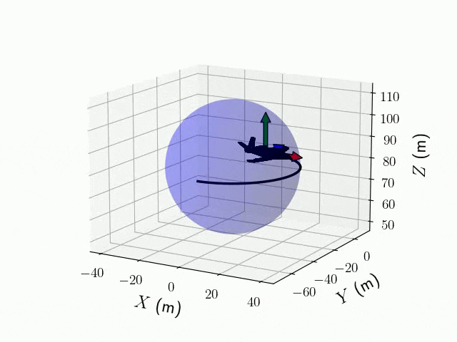 |

| Pitch Up (inner sphere) | Pitch Down (outer sphere) |
|:-----------------------:|:-------------------------:|
| 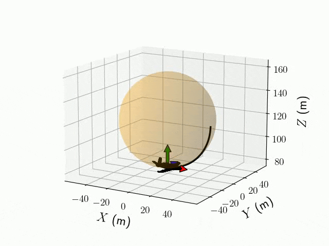 | 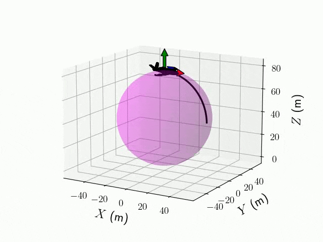 |

## Benchmark Paths — "Long 1"

| ini roll −15°, fin roll 0°, Ryaw 40 | ini roll 0°, fin roll 15°, Ryaw 40 | ini roll 15°, fin roll −15°, Ryaw 40 |
|:------------------------------------:|:-----------------------------------:|:-------------------------------------:|
| 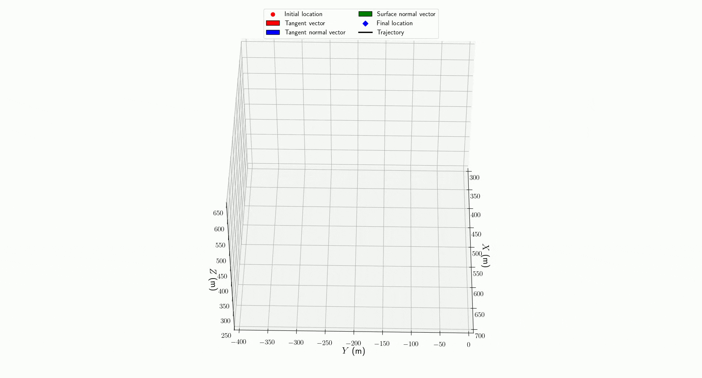 | 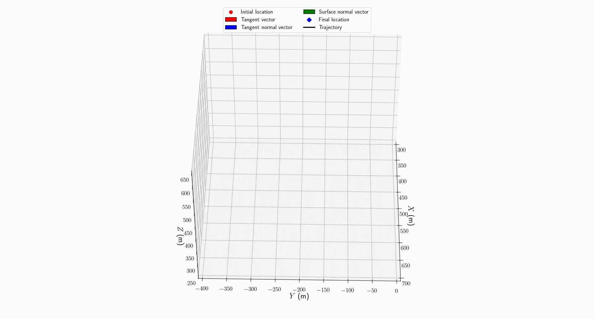 |  |

## Benchmark Paths — "Short 4" (ini roll 15°, fin roll −15°)

| Ryaw = 30 | Ryaw = 40 | Ryaw = 50 |
|:---------:|:---------:|:---------:|
| 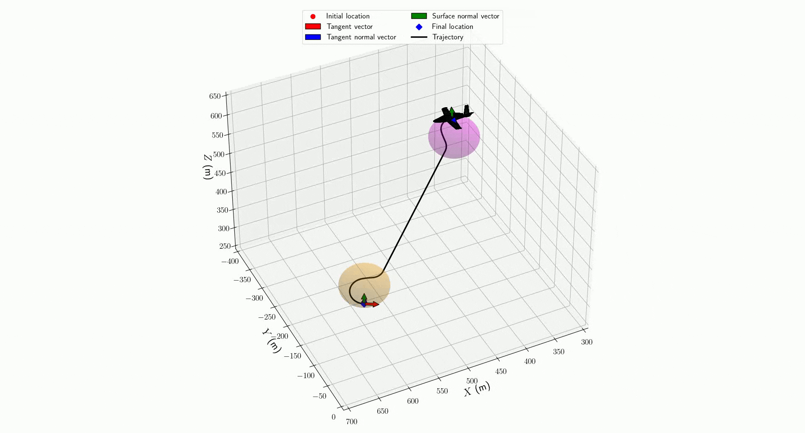 | 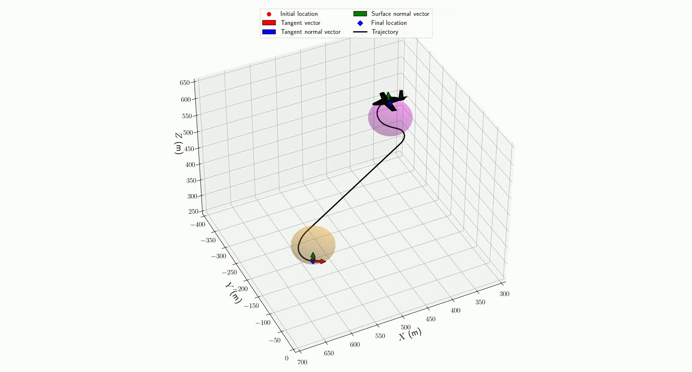 | 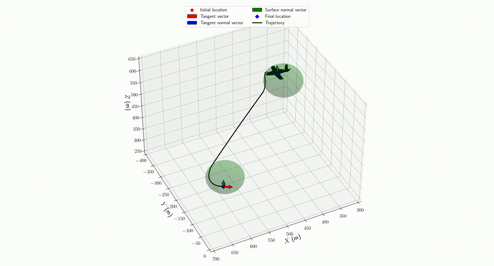 |

## Benchmark Paths — "Additional 2" (ini roll 15°, fin roll −15°)

| Ryaw = 30 | Ryaw = 40 | Ryaw = 50 |
|:---------:|:---------:|:---------:|
| 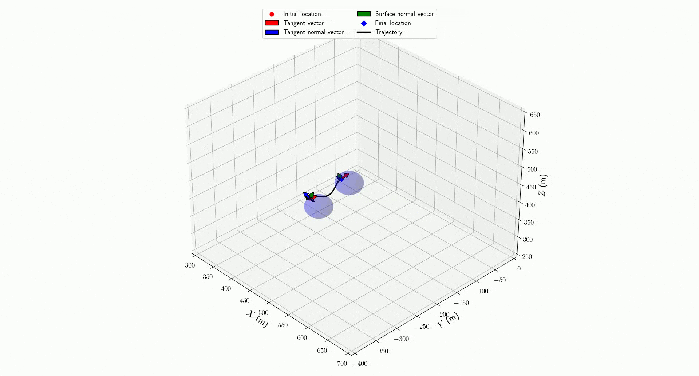 | 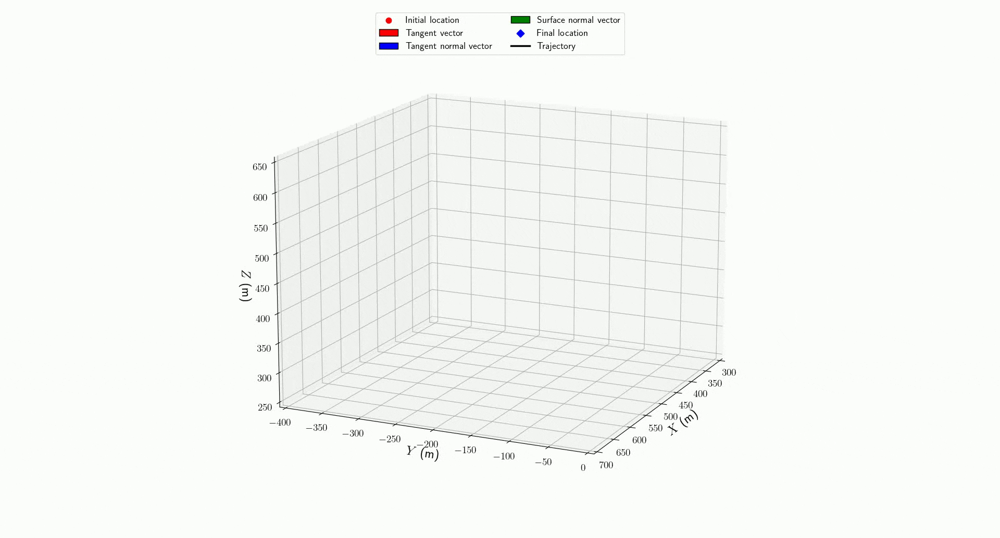 | 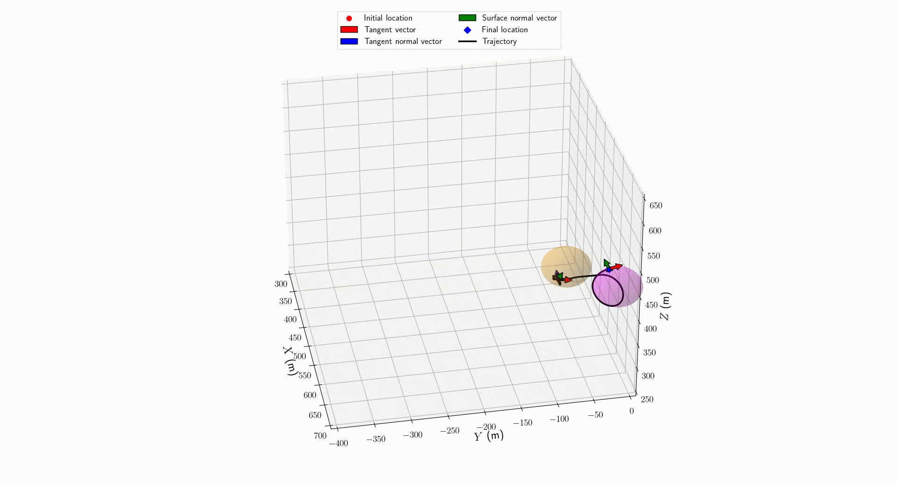 |

## Benchmark Paths — Inside-Sphere Maneuvers

| Inside Yaw Maneuver | Inside Pitch Maneuver |
|:-------------------:|:---------------------:|
| 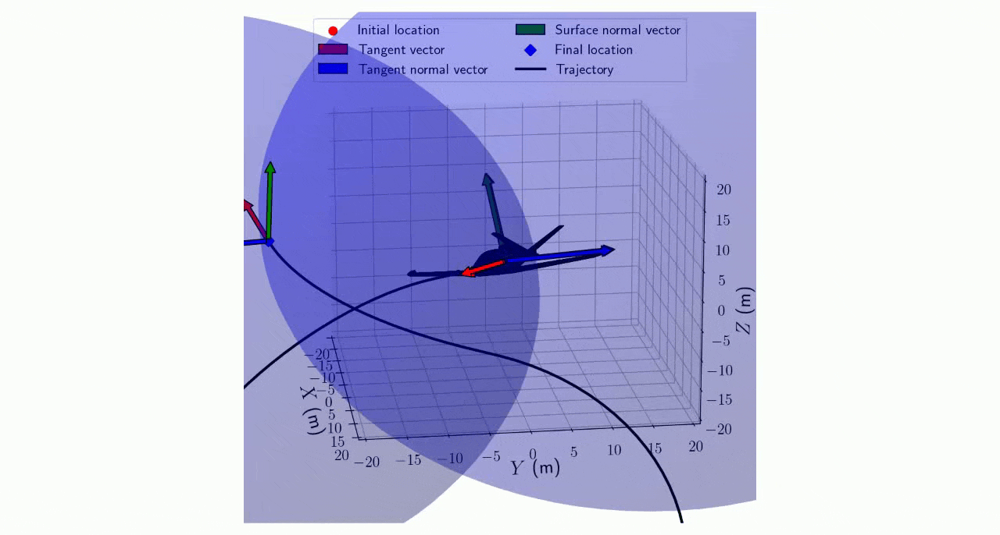 | 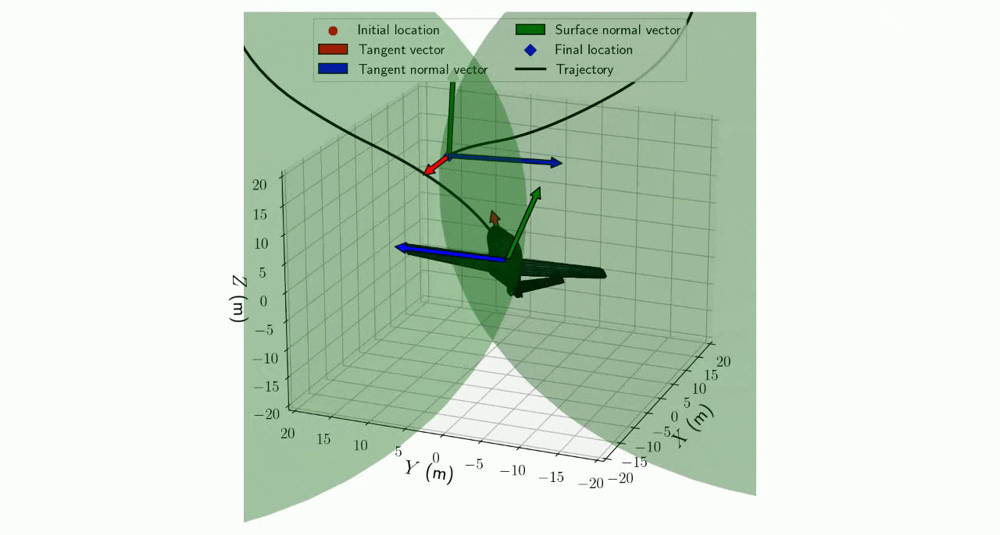 |

# Main code

The main script for running the path planning algorithm is in src -> main.py. In this script, the initial and final configuration for the vehicle can be provided or randomly generated (in the script). In this model, since two control inputs are considered, the bounds for these two (Rpitch and Ryaw) must be provided as inputs. This script calls the function "Dubins_3D_numerical_path_on_surfaces", which contains the main implementation for the path construction algorithm. Additionally, the script also produces an animation for the vehicle traveling along the generated shortest path using the function "plot_trajectory".

For visualization, a majority of the scripts and the stl file (in Visualization folder) was taken from the mavsim_public repository (available at https://github.com/byu-magicc/mavsim_public?tab=readme-ov-file).

# Dependencies

For running the algorithms, the main dependencies that would be needed have been mentioned below.

pip install numpy-stl
pip install opencv-python
<!-- pip install pyqtgraph
pip install PyQt6 -->
pip3 install Pillow
pip install matplotlib (tested on versions 3.5.3, 3.7.2)

## Usage

### Running Single Instances - `main.py`

The `main.py` file can be used to run single instances of the 3D Dubins path planning problem and visualize the outputs. This script allows you to:
- Define initial and final configurations (position, heading angle, pitch angle, roll angle)
- Specify turning radii for pitch and yaw motions
- Generate the optimal path connecting the configurations
- Visualize the computed path with intermediate configurations

### Running Multiple Instances - `running_multiple_instances.py`

The `running_multiple_instances.py` file is designed for running multiple instances of the path planning problem and saving the outputs. This is particularly useful for:
- Batch processing multiple test cases
- Saving results as pickle files for later analysis
- Systematic evaluation of different parameter combinations

### Visualization and Animation - `plotting_results_from_running_multiple_instances.ipynb`

The `plotting_results_from_running_multiple_instances.ipynb` notebook is used in conjunction with `running_multiple_instances.py` to:
- Load the saved pickle files from previously computed instances
- Generate 3D plots of the paths and intermediate configurations
- Visualize the animation of the aircraft following the computed path
- Save the animation as a video file using the `plot_trajectory` function

The `plot_trajectory` function can be configured to either display the animation interactively or save it to a video file by specifying the `video_name` parameter. If only animation is required without saving, set `video_name` to False.

### Core Algorithm - `main_functions_heuristic.py`

Both `main.py` and `running_multiple_instances.py` call the `main_functions_heuristic.py` file, which implements Algorithm~1 from the paper. This function constructs the three classes of paths:
- **Sphere-Cylinder-Sphere**: Paths that use spherical arcs connected by cylindrical segments
- **Sphere-Plane-Sphere**: Paths that use spherical arcs connected by planar segments
- **Sphere-Sphere-Sphere**: Paths composed entirely of spherical arc segments

The algorithm evaluates all three path classes and selects the optimal (shortest) feasible path. Within this function, the associated functions for each path class are called to compute the specific geometric constructions.
